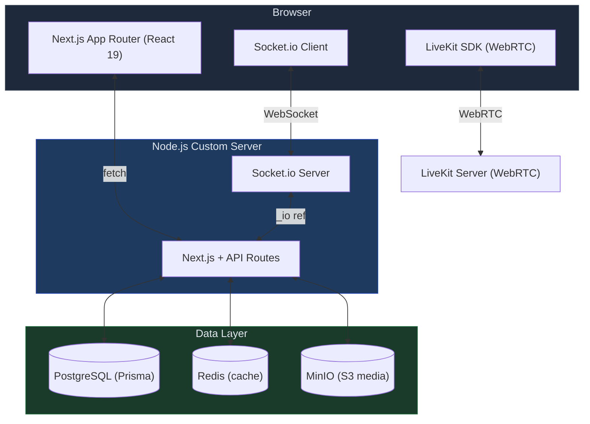

# Let's Tweet — Open Source Social Media

A self-hosted social media platform built with Next.js, PostgreSQL, real-time WebSockets, and MinIO. Runs fully locally or in production via Docker Compose.

> Vibe Coded. Not production-ready.

---

## Architecture



---

## Features

**Posts** — Composer with 280-char limit, mentions, hashtags, emoji/GIF picker, scheduled posts, up to 4 images or 1 video, threaded replies, quote posts, reposts, polls, pin to profile.

**Feed** — For You (engagement-ranked public posts) · Following (chronological) · Explore (trending 24 h) · Full-text search · Trending hashtags sidebar (Redis-cached) · Infinite scroll.

**Messaging** — 1:1 and group DMs · Message requests for non-mutual users · Saved Messages (self-DM) · Real-time via Socket.io · Images, videos, GIFs, emoji reactions, reply threads · Post link previews · Unread indicators · Forward messages · Share posts to conversations or groups.

**Calls** — 1:1 and group voice/video via LiveKit (self-hosted WebRTC) · Incoming call overlay with 30 s auto-decline · Mic/camera toggle · PiP local preview · Missed/ended call system messages in chat · Group calls continue when at least one participant accepts.

**Social** — Follow/unfollow with optimistic UI · Block/unblock with confirmation · Mutual-follow enforcement for DMs · Private accounts (posts locked for non-followers) · Notifications (like, reply, repost, follow, mention, quote, group activity) · Bookmarks · Lists · Verified badge.

**Profiles** — Avatar + banner upload · Bio, location, website · Private account toggle · Posts / Replies / Media / Likes tabs · Follower & following lists.

**UX** — Optimistic UI everywhere · Media lightbox with keyboard nav · Responsive (desktop sidebar + mobile bottom nav) · Dark/light/system theme · Toast feedback on all writes.

---

## Tech Stack

| Layer     | Technology                                      |
| --------- | ----------------------------------------------- |
| Framework | Next.js 16 (App Router) + React 19 + TypeScript |
| Styling   | Tailwind CSS v4                                 |
| Database  | PostgreSQL 15 + Prisma ORM                      |
| Auth      | Custom JWT + bcrypt (httpOnly cookies)          |
| Real-time | Socket.io (custom Node.js server)               |
| Calls     | LiveKit (self-hosted WebRTC)                    |
| Storage   | MinIO (S3-compatible, self-hosted)              |
| Cache     | Redis 7                                         |
| State     | Zustand + TanStack Query v5                     |
| Container | Docker Compose                                  |

---

## Quick Start

**Prerequisites:** Docker Desktop · Node.js 20+

```bash
git clone <repo-url> social && cd social
npm install
cp .env.example .env
docker compose up -d db redis minio minio-init livekit
npx prisma migrate dev
npm run dev
```

Open [http://localhost:3000](http://localhost:3000).

### Local service URLs

| Service       | URL                   | Credentials                     |
| ------------- | --------------------- | ------------------------------- |
| App           | http://localhost:3000 | —                               |
| MinIO Console | http://localhost:9001 | `letstweet` / `letstweet`       |
| pgAdmin       | http://localhost:5050 | `admin@letstweet` / `letstweet` |
| PostgreSQL    | localhost:5432        | db `letstweet` / `letstweet`    |
| Redis         | localhost:6379        | password: `letstweet`           |
| LiveKit       | ws://localhost:7880   | key `devkey` / `secret`         |

### Testing calls

```bash
# Find your LAN IP
ipconfig getifaddr en0   # Mac
hostname -I              # Linux

# Add to .env
NEXT_PUBLIC_LIVEKIT_URL=ws://<lan-ip>:7880
LIVEKIT_NODE_IP=<lan-ip>

# Restart
docker compose up -d --force-recreate livekit && npm run dev
```

### Useful commands

```bash
npx prisma studio                          # DB browser
npx prisma migrate dev --name <desc>       # New migration
docker compose logs -f                     # Tail all logs
npx prisma migrate reset                   # Reset DB (destructive)
```

---

## Production

```bash
# 1. Set secrets in .env
JWT_SECRET=<64-char random>
POSTGRES_PASSWORD=<strong>
MINIO_ROOT_PASSWORD=<strong>
REDIS_PASSWORD=<strong>
NEXT_PUBLIC_APP_URL=https://yourdomain.com
NEXT_PUBLIC_MINIO_PUBLIC_URL=https://media.yourdomain.com
NEXT_PUBLIC_LIVEKIT_URL=wss://livekit.yourdomain.com
LIVEKIT_NODE_IP=<server public IP>

# 2. Build and start
docker compose up -d --build
```

`--build` is required when `NEXT_PUBLIC_*` variables change (baked into the JS bundle at build time). The app container runs `prisma migrate deploy` automatically on first boot.

Put Nginx or Caddy in front on port 3000. Proxy MinIO on a subdomain pointing to port 9000. Expose LiveKit port 7880 (WS) and UDP 7882 (media).

---

## Environment Variables

| Variable                       | Default                 | Description                                       |
| ------------------------------ | ----------------------- | ------------------------------------------------- |
| `DATABASE_URL`                 | _(see .env.example)_    | PostgreSQL connection string                      |
| `REDIS_URL`                    | _(see .env.example)_    | Redis connection string                           |
| `JWT_SECRET`                   | `letstweet`             | Session token signing secret — **change in prod** |
| `NEXT_PUBLIC_APP_URL`          | `http://localhost:3000` | Canonical app URL                                 |
| `MINIO_ENDPOINT`               | `localhost`             | MinIO hostname                                    |
| `MINIO_ACCESS_KEY`             | `letstweet`             | MinIO access key                                  |
| `MINIO_SECRET_KEY`             | `letstweet`             | MinIO secret key                                  |
| `MINIO_PUBLIC_URL`             | `http://localhost:9000` | Public base URL for served media                  |
| `NEXT_PUBLIC_MINIO_PUBLIC_URL` | `http://localhost:9000` | Same, exposed to browser                          |
| `LIVEKIT_URL`                  | `ws://livekit:7880`     | LiveKit server URL (server-side)                  |
| `LIVEKIT_API_KEY`              | `devkey`                | LiveKit API key                                   |
| `LIVEKIT_API_SECRET`           | `secret`                | LiveKit API secret                                |
| `NEXT_PUBLIC_LIVEKIT_URL`      | `ws://localhost:7880`   | LiveKit URL (browser)                             |
| `LIVEKIT_NODE_IP`              | _(auto)_                | LAN/public IP for WebRTC ICE candidates           |
| `GIPHY_API_KEY`                | —                       | Optional — GIF search                             |

---

## License

MIT — see [LICENSE](LICENSE)
